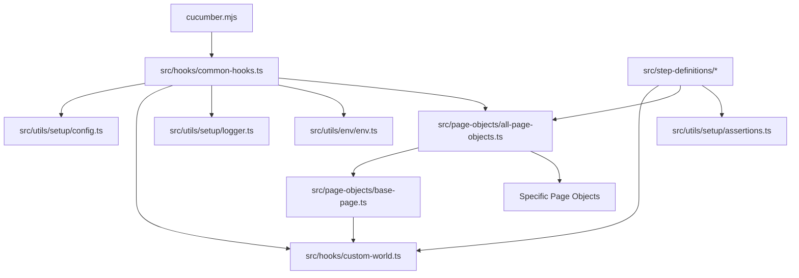

# Dependency Map

## Module Relationships

## Dependency Graph & Core Services
1. **Core Runtime Engine**: `@cucumber/cucumber` orchestrates the run and invokes Hooks and Step Definitions.
2. **Execution Context**: `CustomWorld` acts as the shared context. It depends heavily on `Playwright` instances (`Page`, `BrowserContext`, `APIRequestContext`).
3. **Configuration Module**: `dotenv` parses environment files, which `Config` consumes to instruct Playwright browser options.
4. **Reporting Layer**: Hooks extract Har, Traces, Videos, and Allure attachments upon test failure/completion.

## Shared Components & Duplicate Logic
* **Logging Setup**: Both console logger and file logger are instantiated redundantly per test case.
* **Assertions**: Assertions exist both in `BasePage` and in `assertions.ts`, showing a lack of standardized assertion practices.

## Candidate Extraction Opportunities
* **Browser Factory**: Extract browser launch and context creation out of `common-hooks.ts` into an independent `BrowserFactory` or `DriverFactory`.
* **Reporter Aggregator**: Extract reporting attachments (Traces, Screenshots, Hars) into a dedicated `ReporterService`.
* **Configuration Manager**: Create a strongly-typed `ConfigurationManager` to read, validate, and merge `.env` and `cucumber.mjs` configurations.
