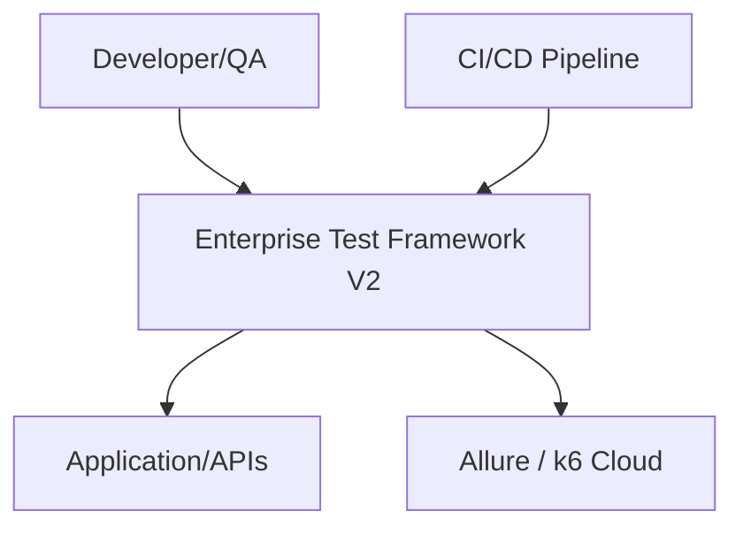
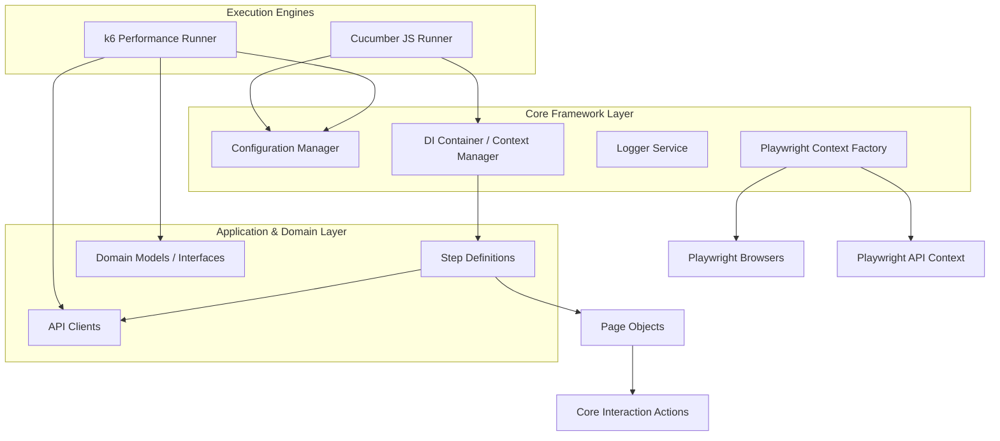

# V2 Enterprise Architecture

## System Architecture

### Context Diagram


### Component Diagram


## Architectural Principles

1. **SOLID Principles**: 
   - *Single Responsibility*: Page objects do not perform assertions. API clients do not manage browser lifecycles.
   - *Dependency Inversion*: Rely on abstractions (e.g., `IConfig`) rather than concrete configurations. DI container handles instantiation.
2. **Clean Architecture / Hexagonal Architecture**:
   - **Domain**: Testing models, User personas, Data Entities. Shared between UI, Functional API, and Performance tests.
   - **Application**: Step Definitions, Workflows, Scenarios.
   - **Infrastructure**: Playwright wrappers, k6 scripts, HTTP Clients.
3. **Multi-Faceted Testing Hub**: 
   - UI automation via Playwright.
   - Functional API automation via Playwright `request`.
   - Performance Load testing via `k6`.

## Layer Structure

The V2 framework will adopt the following structure:

```
src/
├── domain/            # Test data models, personas, domain business rules
├── application/       # Cucumber Step Definitions (shared)
├── infrastructure/    # Driver factories, Logger implementations, API clients
│   ├── config/        # Centralized typed configuration (zod)
│   ├── driver/        # Playwright browser factories and lifecycles
│   └── reporters/     # Allure, custom reporting connectors
├── presentation/      # Page Objects, Component Objects (UI layer)
├── shared/            # Shared utilities (dates, strings, Cucumber DataTable parsers)
└── performance/       # k6 load testing scripts and scenarios

tests/
├── ui/                # UI-focused .feature files
└── api/               # API-focused .feature files
```

### Responsibilities
* **`domain/`**: Contains interfaces and POJOs representing test entities (e.g., `User`, `Order`, `Payment`). Data is sourced from feature files.
* **`application/`**: Step definitions interact with domain entities and orchestrate the `presentation` layer and `infrastructure` APIs.
* **`infrastructure/`**: The dirty details. Playwright logic, browser launching, HTTP requests.
* **`presentation/`**: strictly UI mapping and interactions. No assertions. Return data to the application layer. Injected via `tsyringe`.
* **`performance/`**: standalone k6 scripts utilizing the `domain` and `API` clients for high-throughput testing.
* **`tests/`**: Split cleanly between `ui/` and `api/` to allow discrete CI pipeline execution.
